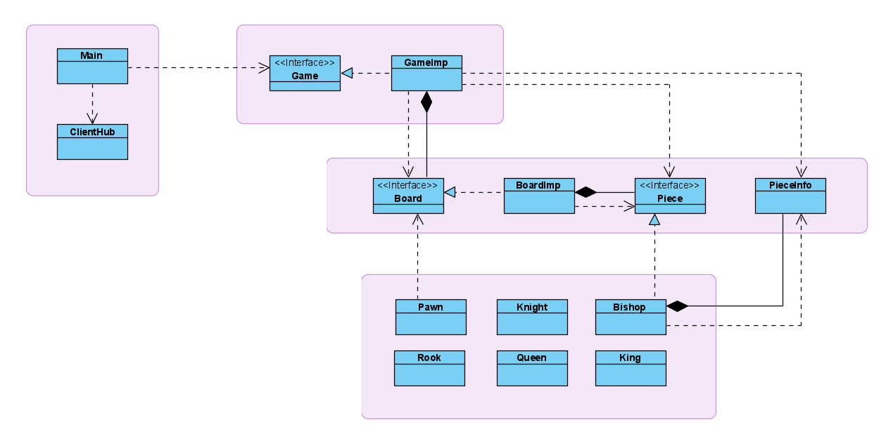

# Chess :chess_pawn:
Chess, implemented in Go. This is an ongoing project.

## Roadmap
:heavy_check_mark: Chess movement and capture rules for all pieces

:heavy_check_mark: Clients connect to server via Websocket

:heavy_check_mark: Clients able to play each other by interacting with chess board UI element (React-Chessground package)

:o: Special chess rules, such as castling, promotion, and en passant

:o: Game rooms

:o: Dockerize (additionally, considering Terraform or K8s)

Clearly there's a long way to go, but the journey is important as well!

## Design

Here is the UML diagram for the Go backend:

Design Highlights
* Decoupling the main function (which handles client requests) from game logic by using an interface
* Experimenting ideas with composition to reduce duplicate code
